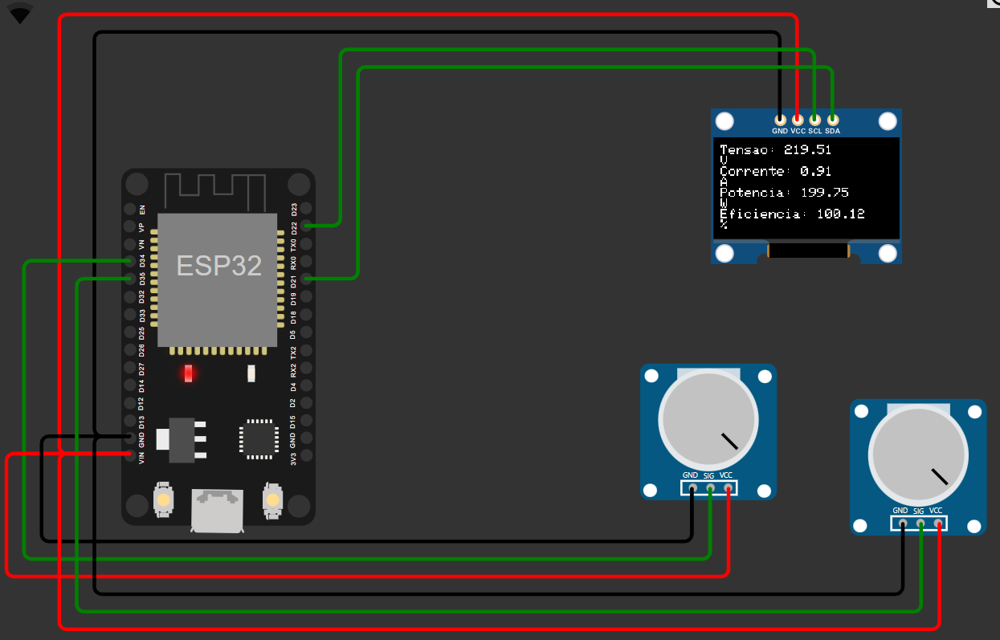
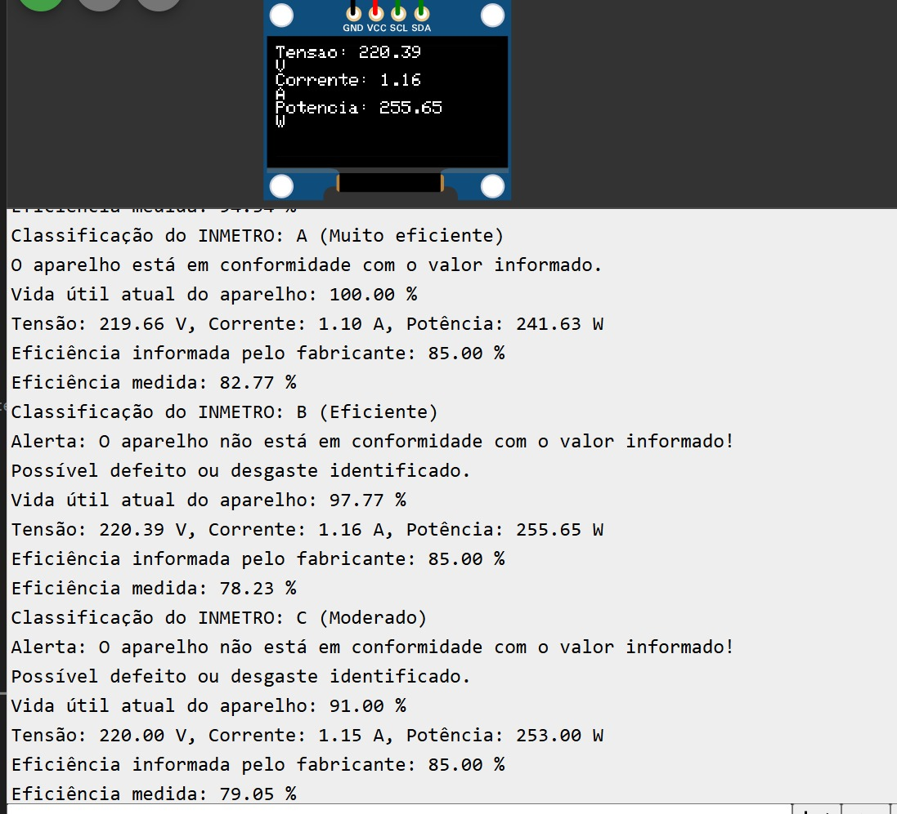
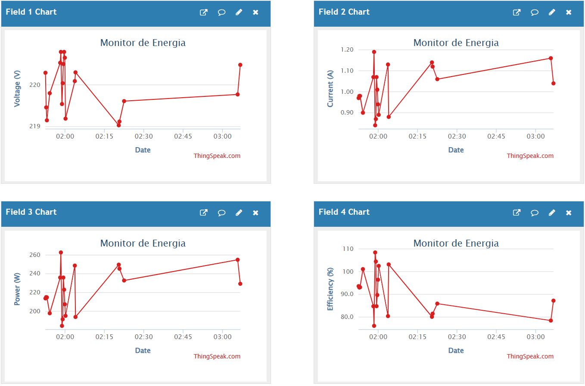

---

# **Projeto IoT - Gestão Inteligente de Descarte de Resíduos Eletrônicos**


### 💬 **Integrantes**  
- **Ana Carolina Tavares** - RM552283  
- **Vinicius Minei** - RM98486  
- **Sofia Sprocatti** - RM99208  
- **Gabriel Lopes Pereira** - RM98023  

---

## **Índice**
- [👨‍👨‍👧‍👧 Equipe SUSEarth](#-equipe-susearth)
- [📚 Descrição da proposta](#-descrição-da-proposta)
- [🚀 Funcionalidades IoT](#-funcionalidades-iot)
- [🎯 Requisitos do Desafio](#-requisitos-do-desafio)
- [📝 Componentes](#-componentes)
- [✅ Funcionamento](#-funcionamento)
  - [1. Captura de Dados](#1-captura-de-dados)
  - [2. Processamento](#2-processamento)
  - [3. 📊 Visualização dos Dados](#3-visualização-dos-dados)
  - [4. 💹 Gateway](#4-gateway)
- [⚙️ Configuração](#️-configuração)
  - [1. Acesso ao circuito no Wokwi](#1-acesso-ao-circuito-no-wokwi)
  - [2. Visualização no ThingSpeak](#2-visualização-no-thingspeak)
  - [3. Configurar ThingSpeak](#3-configurar-thingspeak)
  - [4. 📽️ VÍDEO DO PROJETO](#4-📽️-vídeo-do-projeto)

---

## 📚 Descrição da proposta

O projeto **SUSEarth** propõe uma solução inteligente para o gerenciamento do descarte de resíduos eletrônicos. Utilizando dispositivos IoT e plataformas digitais, buscamos facilitar a localização de pontos de coleta de resíduos eletrônicos e incentivar práticas sustentáveis. A solução tem como objetivo:

- Localizar pontos de coleta de resíduos eletrônicos próximos ao usuário, com base em informações de GPS.
- Auxiliar na gestão dos pontos de coleta de forma eficiente e otimizada.
- Promover a conscientização sobre a importância do descarte correto de resíduos eletrônicos.

## 🚀 Funcionalidades IoT
- Monitoramento em tempo real de dados de pontos de coleta, como capacidade disponível e localização.
- Exibição local de dados no display OLED e envio para a plataforma **ThingSpeak**.
- Estimativa de capacidade dos pontos de coleta e alertas sobre preenchimento.

## 🎯 Requisitos do Desafio
| **Requisito**                                   | **Como foi atendido**                                                                                     |
|-------------------------------------------------|----------------------------------------------------------------------------------------------------------|
| **Sistema IoT com 2 dispositivos**             | Integração de sensores para monitoramento de pontos de coleta e controle de dados, como proximidade e capacidade. |
| **Hardware**                                   | Utilização de um microcontrolador como o ESP32, com display OLED para visualização local.  |
| **Dashboard**                                  | Dados enviados ao ThingSpeak, funcionando como gateway e painel de visualização em tempo real.           |
| **Gateway**                                    | Configuração com MQTT para envio de dados para a plataforma de visualização.                             |
| **Protocolos**                                 | Implementação de protocolo MQTT para troca de mensagens entre dispositivos e a plataforma.                   |
| **Desenvolvimento em simulador**               | Projeto desenvolvido no Wokwi para simulação e testes.                            |

## 📝 Componentes

- **ESP32**: Microcontrolador principal responsável pela coleta e processamento de dados.
- **Display OLED (128x64)**: Exibe informações locais em tempo real.
- **Sensores de localização e capacidade**: Monitoram a posição e a quantidade de resíduos no ponto de coleta.
- **Conexão Wi-Fi**: Envia os dados ao **ThingSpeak**.
- **ThingSpeak**: Plataforma utilizada como gateway e dashboard para monitorar os dados.

<p align="center">
  
</p>

## ✅ Funcionamento

### 1. Captura de Dados
- **Localização do ponto de coleta**: Obtida via GPS ou coordenadas de entrada.
- **Capacidade de coleta**: Monitorada por sensores de peso ou proximidade.

### 2. Processamento
O ESP32 processa os dados de localização e capacidade, verificando a necessidade de redirecionamento de resíduos para outros pontos, conforme capacidade disponível.

### 3. 📊 Visualização dos Dados
1. **No Serial Monitor**:
   - Acompanhe dados de localização, capacidade e status de pontos de coleta diretamente pelo monitor serial.
2. **No Display OLED**:
   - Veja os dados processados localmente.
3. **No ThingSpeak**:
   - Acesse o canal e visualize gráficos e históricos.

<p align="center">
  
</p>

### 4. 💹 Gateway
- Os dados são enviados ao ThingSpeak via MQTT, onde podem ser visualizados em gráficos.

<p align="center">
  
</p>

## ⚙️ Configuração

### 1. Acesso ao circuito no Wokwi
É possível acessar os arquivos do circuito no diretório [Wokwi](./Wokwi) deste projeto.

Clique no LINK para visualizar e testar o circuito diretamente na plataforma Wokwi: 

* [LINK da Simulação do Circuito no Wokwi](https://wokwi.com/projects/415143736305192961).

### 2. Visualização no ThingSpeak
Acompanhe os dados gerados pelo projeto diretamente pelo link abaixo:
* [LINK do canal no ThingSpeak](https://thingspeak.mathworks.com/channels/2756384).

### 3. Configurar ThingSpeak
Caso deseje, substitua `YOUR_API_KEY` pela chave de API de escrita do seu canal no ThingSpeak:
```cpp
const String apiKey = "SUA_API_KEY";
```
